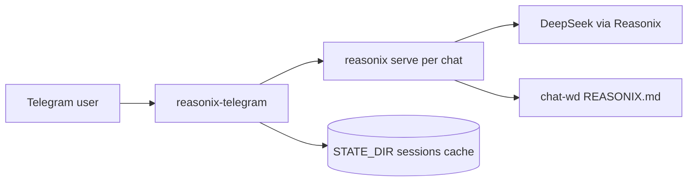

# reasonix-telegram

**English** · [中文](#中文)

Telegram bridge for [Reasonix](https://github.com/esengine/DeepSeek-Reasonix) (DeepSeek-native agent runtime). One long-lived `reasonix serve` process per chat, resumable JSONL sessions, and a chat-only tool profile suitable for persona-driven DM bots—not a fork of Reasonix.

---

## Overview

| | |
|---|---|
| **Role** | Thin Telegram frontend over Reasonix HTTP + SSE |
| **Mode** | Pure chat (`tools.enabled = ["none"]` in dedicated workdir) |
| **Transport** | Native draft streaming (`sendMessageDraft` → `sendMessage` finalize) |
| **Sessions** | Per-chat JSONL under `STATE_DIR`, restored after bridge restart |



---

## Features

- **Per-chat `reasonix serve`** — isolated port, cwd, and session file per Telegram `chat_id`
- **Session resume** — conversation survives bridge restarts (`reasonix serve --resume`)
- **Streaming UX** — live draft preview, then final message(s); typing indicator while generating
- **Long replies** — auto-split at Telegram’s 4096-character limit (no `…[cut]…` in user-visible text)
- **Chat-only lockdown** — plan/bypass off; tool dispatches cancelled; no “agent work” surface in TG
- **User rules** — `~/.config/reasonix/REASONIX.md` (Reasonix global); bridged into `chat-wd/REASONIX.md` (not `AGENTS.md`, so Hermes won't pick it up from `$HOME`)
- **Slash commands** — `/stop`, `/status`, `/new`, `/restart`, `/help`, …

---

## Requirements

- Go **1.24+**
- [`reasonix`](https://github.com/esengine/DeepSeek-Reasonix) on `PATH` (typically `main-v2`)
- Linux recommended for production (`systemd`, `/proc` for process cleanup)
- Telegram Bot API token + DeepSeek API key

---

## Quick start

```bash
git clone https://github.com/dorokuma/reasonix-telegram.git
cd reasonix-telegram
go build -o reasonix-telegram .

cp .env.example /etc/reasonix-telegram.env
# Edit: TG_BOT_TOKEN, DEEPSEEK_API_KEY, ALLOWED_USERS (recommended)

export $(grep -v '^#' /etc/reasonix-telegram.env | xargs)
./reasonix-telegram
```

For production, see [Deployment](#deployment).

---

## Configuration

| Variable | Required | Default | Description |
|----------|----------|---------|-------------|
| `TG_BOT_TOKEN` | yes | — | BotFather token |
| `DEEPSEEK_API_KEY` | yes* | — | Passed to Reasonix (`*required for DeepSeek provider`) |
| `ALLOWED_USERS` | no | *(empty = allow everyone)* | Comma-separated Telegram user IDs; if set, only these users may use the bot |
| `REASONIX_BIN` | no | `reasonix` | Path to Reasonix binary |
| `STATE_DIR` | no | `/var/lib/reasonix-telegram` | Sessions, cache, `chat-wd` |
| `MAX_OUTPUT_BYTES` | no | `524288` | Stream buffer cap before split-send; tail truncated if exceeded |
| `MAX_DURATION_MIN` | no | `30` | Per-turn timeout (minutes) |
| `MODEL` | no | Reasonix default | e.g. `deepseek-v4-flash` |
| `CHAT_RULES_FILE` | no | `~/.config/reasonix/REASONIX.md` | Override path; symlinked into `$STATE_DIR/chat-wd/REASONIX.md` |

**Persona / rules:** Use Reasonix's user-global **`~/.config/reasonix/REASONIX.md`** (not `$HOME/AGENTS.md` — that file is shared with Hermes and other agents). The bridge symlinks it into `chat-wd`; it does not inject character prompts. After rule changes, send **`/new`** in Telegram so the active session reloads system context (restart alone is not enough for an existing JSONL session).

**Limits (user-visible):**

- One Telegram message ≤ **4096 characters**; longer assistant text is sent as **multiple sequential messages**
- Stream buffer hard cap **512 KiB**; beyond that, tail is dropped with a Chinese notice `（内容过长，已截断尾部）`

---

## Bot commands

| Command | Action |
|---------|--------|
| `/start`, `/help` | Help text |
| `/stop`, `/cancel` | Cancel in-flight turn |
| `/status` | Whether a reply is generating |
| `/new`, `/clear` | New Reasonix session (drop JSONL for this chat) |
| `/restart` | Graceful `systemctl restart` + post-restart “connected” ping |

Plain text messages run a full Reasonix turn. Replying to a message prepends quoted context.

---

## Streaming behavior

1. **`sendChatAction(typing)`** — refreshed every ~4s until the turn ends  
2. **`sendMessageDraft`** — preview shows the **last** 4096 characters of in-progress text  
3. **Finalize** — on `message` / `turn_done`: final draft frame, then one or more **`sendMessage`** parts  
4. **Cancel** — if content was already delivered, no extra “aborted” bubble on user `/stop`

Fallback: if draft API fails, falls back to `sendMessage` + `editMessageText`.

---

## Build

```bash
go build -o reasonix-telegram .
go test ./...
```

**ARM64 server (e.g. Oracle Cloud):**

```bash
GOOS=linux GOARCH=arm64 go build -o reasonix-telegram .
```

Optional: `make reasonix` clones/builds upstream Reasonix to `/usr/local/bin/reasonix`.

---

## Deployment

1. Install binary: `/usr/local/bin/reasonix-telegram`
2. Env file: `/etc/reasonix-telegram.env` (mode `600`)
3. Unit: `deploy/reasonix-telegram.service`

```bash
make install
# or manually:
install -m 0755 reasonix-telegram /usr/local/bin/
cp deploy/reasonix-telegram.service /etc/systemd/system/
systemctl daemon-reload
systemctl enable --now reasonix-telegram
journalctl -u reasonix-telegram -f
```

The unit uses `ProtectSystem=strict`, `ReadWritePaths=/var/lib/reasonix-telegram`, and `ProtectHome=read-only` — caches live under `STATE_DIR`, not `~/.cache`.

---

## Relation to Reasonix

This repository is **not** Reasonix. It spawns and talks to `reasonix serve`:

- Submit: `POST /submit`
- Events: `GET /events` (SSE)
- Control: `/plan`, `/bypass`, `/cancel`, …

Upstream: [esengine/DeepSeek-Reasonix](https://github.com/esengine/DeepSeek-Reasonix). Tool-disable and serve-mode behavior depend on your Reasonix build and `reasonix.toml` in `chat-wd`.

---

## Troubleshooting

| Symptom | Check |
|---------|--------|
| No typing indicator | Logs for `sendChatAction`; must use `Request`, not `Send` (fixed in recent versions) |
| Rules not applied | `~/.config/reasonix/REASONIX.md` + `chat-wd/REASONIX.md` symlink; send **`/new`** |
| Reply truncated mid-sentence with `…[cut]…` | Old build; upgrade — user text uses split-send, not cut markers |
| `Reasonix 服务启动失败` | `reasonix` on PATH, `DEEPSEEK_API_KEY`, port range ~18780+ |
| Stuck after `/restart` | Wait for 🟢 connected message; watchdog clears “restarting” after ~45s |

---

## License

Add a `LICENSE` file when publishing publicly; until then, follow your deployment repo policy.

---

# 中文

面向 [Reasonix](https://github.com/esengine/DeepSeek-Reasonix) 的 Telegram 桥接服务：每个聊天维护一个长期 `reasonix serve` 进程，JSONL 会话可恢复，工作区强制纯聊天（关闭工具），适合人设驱动的私聊 Bot。**不是** Reasonix 的分支。

---

## 概述

| | |
|---|---|
| **定位** | 通过 HTTP + SSE 驱动 Reasonix 的 Telegram 薄前端 |
| **模式** | 纯聊天（独立 `chat-wd` 内 `tools.enabled = ["none"]`） |
| **展示** | 原生草稿流（`sendMessageDraft` → `sendMessage` 定稿） |
| **会话** | 按 `chat_id` 存于 `STATE_DIR`，桥接重启后可 resume |

---

## 功能

- **每聊一个 `reasonix serve`** — 独立端口、工作目录、会话文件
- **会话恢复** — 桥接重启后继续同一 JSONL（`--resume`）
- **流式体验** — 草稿预览 + 正式消息；生成时显示「正在输入」
- **长文回复** — 超过 Telegram 单条 **4096 字** 自动连发多条，用户可见正文无 `…[cut]…`
- **纯聊天加固** — 关闭 plan/bypass；拦截工具调度，不在 TG 里干「工程师活」
- **用户规则** — 使用 `~/.config/reasonix/REASONIX.md`，桥接软链到 `chat-wd/REASONIX.md`（勿放 `$HOME/AGENTS.md`，会被 Hermes 读取）
- **斜杠命令** — `/stop`、`/status`、`/new`、`/restart`、`/help` 等

---

## 环境要求

- Go **1.24+**
- `PATH` 上有 [`reasonix`](https://github.com/esengine/DeepSeek-Reasonix)（常用分支 `main-v2`）
- 生产环境建议 Linux（`systemd`、进程清理依赖 `/proc`）
- Telegram Bot Token + DeepSeek API Key

---

## 快速开始

```bash
git clone https://github.com/dorokuma/reasonix-telegram.git
cd reasonix-telegram
go build -o reasonix-telegram .

cp .env.example /etc/reasonix-telegram.env
# 编辑：TG_BOT_TOKEN、DEEPSEEK_API_KEY、ALLOWED_USERS（建议配置）

export $(grep -v '^#' /etc/reasonix-telegram.env | xargs)
./reasonix-telegram
```

生产部署见 [部署](#部署)。

---

## 配置说明

| 变量 | 必填 | 默认 | 说明 |
|------|------|------|------|
| `TG_BOT_TOKEN` | 是 | — | BotFather 令牌 |
| `DEEPSEEK_API_KEY` | 是* | — | 交给 Reasonix 使用 |
| `ALLOWED_USERS` | 否 | 空=所有人可用 | 逗号分隔 Telegram 用户 ID；配置后仅允许列表内用户 |
| `REASONIX_BIN` | 否 | `reasonix` | Reasonix 可执行文件路径 |
| `STATE_DIR` | 否 | `/var/lib/reasonix-telegram` | 会话、缓存、`chat-wd` |
| `MAX_OUTPUT_BYTES` | 否 | `524288` | 流式缓冲上限，超出后尾部截断再发送 |
| `MAX_DURATION_MIN` | 否 | `30` | 单轮超时（分钟） |
| `MODEL` | 否 | Reasonix 默认 | 如 `deepseek-v4-flash` |
| `CHAT_RULES_FILE` | 否 | 见 `.env.example` | 软链到 `chat-wd` 的规则文件 |

**人设 / 规则：** 写在 **`~/.config/reasonix/REASONIX.md`**（Reasonix 官方用户级记忆路径）。桥接只软链到 `chat-wd`，不内置角色 Prompt。改规则后请在 Telegram 发 **`/new`** 开新会话（仅重启服务不会替换已 resume 的 JSONL system）。

**用户可见限制：**

- 单条 Telegram 消息最多 **4096 字**；更长内容拆成**多条连续消息**
- 流式缓冲硬顶 **512 KiB**；超出会丢弃尾部并提示 `（内容过长，已截断尾部）`

---

## 机器人命令

| 命令 | 作用 |
|------|------|
| `/start`、`/help` | 帮助 |
| `/stop`、`/cancel` | 中止当前生成 |
| `/status` | 是否在生成中 |
| `/new`、`/clear` | 新对话（删除该 chat 的 JSONL） |
| `/restart` | 优雅重启服务，恢复后发送已连接提示 |

直接发文字即触发一轮 Reasonix；回复某条消息时会带上被引用原文。

---

## 流式行为

1. **`sendChatAction(typing)`** — 生成期间约每 4 秒刷新  
2. **`sendMessageDraft`** — 预览为当前正文**末尾**最多 4096 字  
3. **定稿** — 收到 `message` / `turn_done`：最后一帧草稿 + 一条或多条 `sendMessage`  
4. **取消** — 若正文已发出，用户 `/stop` 后**不再**额外发「已中止」

若草稿 API 不可用，回退为 `sendMessage` + `editMessageText`。

---

## 编译

```bash
go build -o reasonix-telegram .
go test ./...
```

**ARM64 服务器：**

```bash
GOOS=linux GOARCH=arm64 go build -o reasonix-telegram .
```

可选：`make reasonix` 构建上游 Reasonix 到 `/usr/local/bin/reasonix`。

---

## 部署

1. 二进制：`/usr/local/bin/reasonix-telegram`
2. 环境文件：`/etc/reasonix-telegram.env`（建议 `chmod 600`）
3. systemd：`deploy/reasonix-telegram.service`

```bash
make install
journalctl -u reasonix-telegram -f
```

单元文件限制系统目录只读，仅 `STATE_DIR` 可写；缓存不依赖 `ProtectHome` 下的 `~/.cache`。

---

## 与 Reasonix 的关系

本仓库**不是** Reasonix 本体，只负责拉起并调用 `reasonix serve`（`/submit`、`/events` SSE 等）。上游：[esengine/DeepSeek-Reasonix](https://github.com/esengine/DeepSeek-Reasonix)。工具禁用等行为由你的 Reasonix 构建及 `chat-wd/reasonix.toml` 决定。

---

## 故障排查

| 现象 | 排查 |
|------|------|
| 没有「正在输入」 | 查日志 `sendChatAction`；需用 `Request` 而非 `Send` |
| 规则不生效 | 检查 `chat-wd` 软链；发 **`/new`** |
| 回复出现 `…[cut]…` | 升级旧版本；新版本对用户正文拆条，不在句末 cut |
| Reasonix 启动失败 | `reasonix` 是否在 PATH、`DEEPSEEK_API_KEY`、端口约 18780+ |
| `/restart` 后无响应 | 等 🟢 提示；约 45s  watchdog 会解除「重启中」锁 |

---

## 许可证

公开发布前请添加 `LICENSE`；否则遵循你方部署仓库的约定。